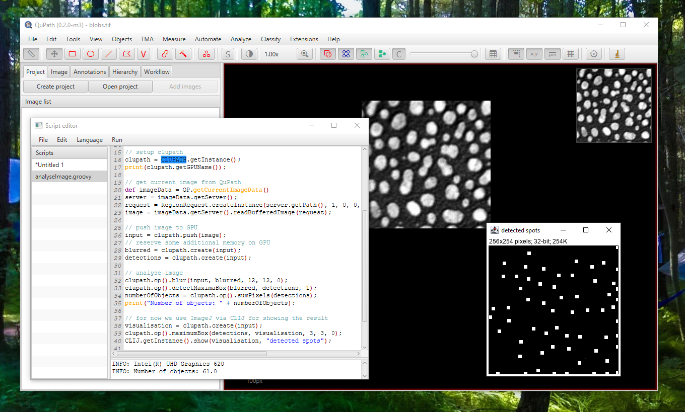

# clupath
 
clupath is a bridge between [QuPath](https://qupath.github.io/) and [clij](https://clij.github.io/).

Right now, this is very preliminary.

## Installation
[Download and install QuPath version 0.2.2](https://github.com/qupath/qupath/releases/tag/v0.2.2). 
In order to make CLUPATH run in QuPath, download the following jar file and drag&drop it on QuPath. QuPath will take care of it and install it in the right folder.
* [clupath-0.2.0.0-jar-with-dependencies.jar](https://github.com/clij/clupath/releases/download/0.2.0.0/clupath-0.2.0.0-jar-with-dependencies.jar)

## Examples
Example code for QuPaths script editor can be found in the [groovy](https://github.com/clij/clupath/tree/master/src/main/groovy) directory.

## Please note
It is recommended to [use clij from Fiji](https://clij.github.io/). QuPath support is experimental.

[Back to CLIJ documentation](https://clij.github.io/)

[Imprint](https://clij.github.io/imprint)
